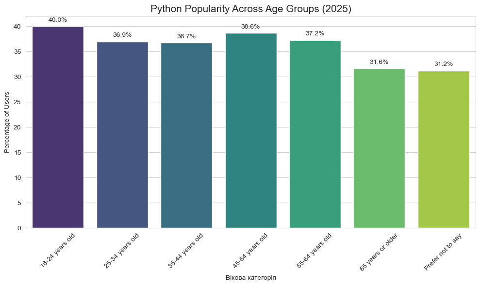
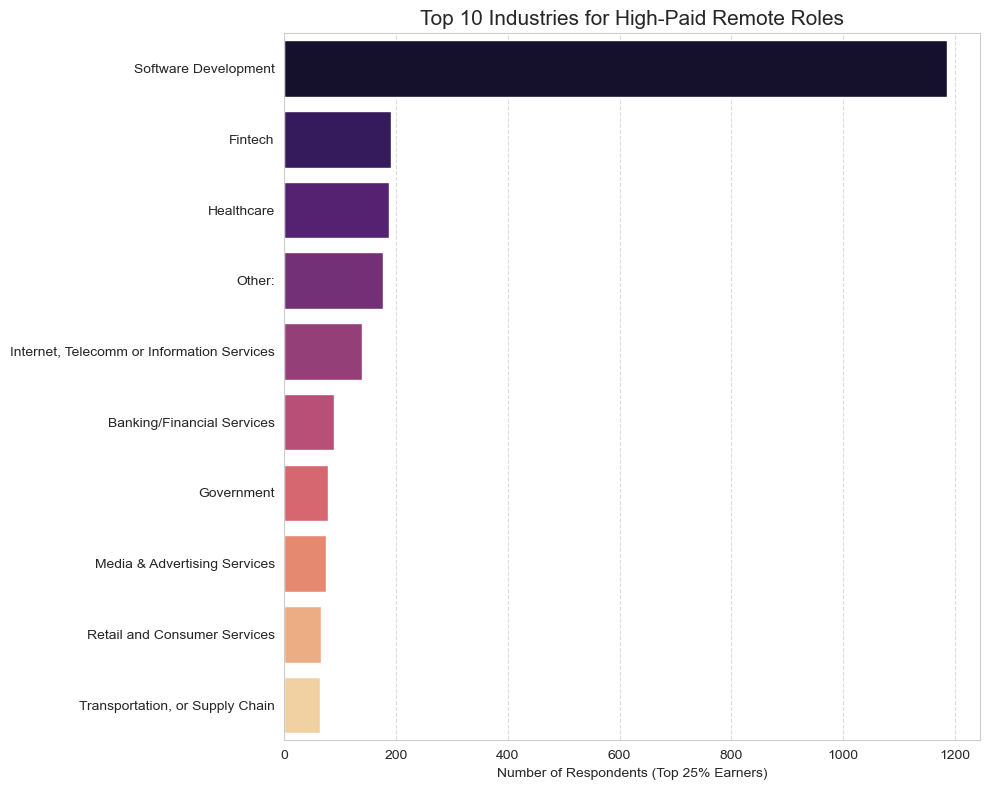

# 📊 Stack Overflow Developer Survey 2025: Exploratory Data Analysis (EDA)

This project provides a comprehensive analysis of the global developer landscape using the latest **Stack Overflow 2025 dataset**. The study focuses on programming language trends, compensation benchmarks, and the impact of remote work across various industries.

## 🎯 Key Insights
* **Python Dominance:** Python remains the top choice for new talent, with a **40% adoption rate** among respondents aged 18-24.
* **Economic Insights:** Identified **Fintech** and **Healthcare** as the leading sectors for high-compensated remote roles (top 25% earners).
* **Education vs. Salary:** Analysis reveals that practical expertise and alternative learning paths (online courses) are highly competitive with traditional degrees in high-income brackets.
* **Work Experience:** The median experience level in the industry is **10 years**, with a significant group of senior professionals pushing the average to 13.4 years.

## 🛠 Tech Stack
* **Language:** Python 3.x
* **Libraries:** * `Pandas` for data cleaning and manipulation.
  * `NumPy` for numerical analysis.
  * `Seaborn` & `Matplotlib` for professional data visualization.
* **Environment:** Jupyter Notebook.

## 📂 Project Structure
* `developer_survey_analysis.ipynb`: The core Jupyter Notebook containing data cleaning, statistical analysis, and EDA.
* `data_schema.csv`: The survey schema containing question descriptions.
* `python_usage_by_age.png`: Visual representation of Python's popularity across age groups.
* `remote_work_industries.png`: Chart highlighting the top industries for remote work.

## 📈 Visualizations

### Python Usage by Age Group

### Top Industries for High-Paid Remote Roles

## 📖 Data Source
The raw dataset used for this analysis (100MB+) is provided by [Stack Overflow Insights](https://insights.stackoverflow.com/survey). Due to size limitations on GitHub, the primary CSV file is not included in this repository but can be accessed via the link above.

---
*Developed as part of a Data Analytics portfolio project to demonstrate proficiency in Python, data cleaning, and statistical storytelling.*# python-pandas-eda-stackoverflow
Exploratory Data Analysis (EDA) of the Stack Overflow 2025 Survey. Insights on Python popularity, remote work trends, and developer compensation using Pandas &amp; Seaborn.
